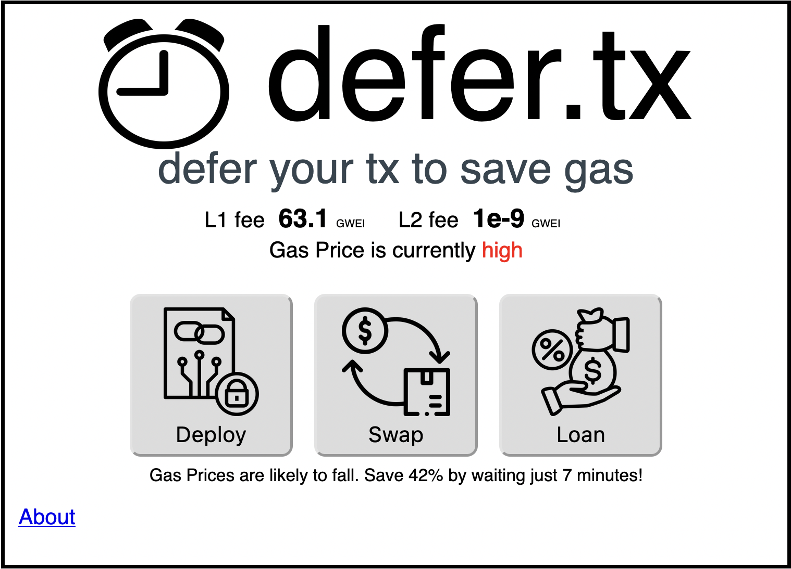

# ⏰ defer.tx

## Overview

defer.tx helps Mantle users save on gas fees. By using ML forecasting to predict future gas prices, defer.tx knows when to wait to send your transaction when gas fees are lower. Use cases include contract deployments, stop losses, token swaps, loan repayments, recurring payments, TWAPs and more. defer.tx is modular so you can build your own plugins to support any use cases you want!

## Frontend

The frontend consists of the **live** L1/L2 gas price, and an indication of whether the current gas price is high or low. To keep things simple, we provide our recommended amount of time to wait and how much gas you can save (in the example below this is 42% for waiting 7 minutes).

## Bounties

### Best Student DApp Project: $6000

First Place: $3000 in USDC

Second Place: $2000 in USDC

Third Place: $1000 in USDC

#### Challenge Description

With your experience and knowledge in the space of blockchain, we would like to learn about what you can build in 10 days! Build any smart contract based DApp project and impress us!

#### Submission Requirements

The submission must be deployed on any Testnet (include a link to smart contract deployed link)

A video demo and GitHub repo must be submitted

#### Judging Criteria

Originality and innovation in the implementation of the DApp

User experience and ease of use for DApp interaction

Relevance and impact on the space of blockchain

Technical feasibility and implementation quality

### Best Defi Project: $2,500 in BIT + $2500 in USDC

Split between four teams, $625 in BIT and $625 in USDC each

#### Challenge Description

Create an implementation (such as core protocol tools, ecosystem tools, use cases for NFTs and the Metaverse, DAOs, DeFi, and DApps) on Mantle.

#### Submission Requirements

The submission must be deployed on Mantle testnet (include a link to smart contract deployed on Mantle Explorer)

A video demo and GitHub repo must be submitted

#### Judging Criteria

Originality and innovation in the implementation of DeFi on Mantle

User experience and ease of use for DeFi-related interactions

Relevance and impact on the overall DeFi ecosystem

Technical feasibility and implementation quality

### Best UX: $2,500 in BIT + $2500 in USDC

Split between four teams, $625 in BIT and $625 in USDC each

#### Challenge Description

One of the most challenging problems in Web3 is creating an intuitive and seamless User Experience for dapps. Build a dapp that raises the bar for UX in some way. Make sure to explain in your submission in detail what you’ve done to make UX more accessible.

Visualize Mantle chain data via dashboards and data visualization

Visualize Mantle address transaction history with a TikTok-like timeline

#### Submission Requirements

The submission must be deployed on Mantle testnet (include a link to smart contract deployed on Mantle Explorer)

A video demo and GitHub repo must be submitted

#### Judging Criteria

User-friendly interface and intuitive design

Innovative approaches to improve accessibility and seamless user experience

Relevance and impact on the overall Web3 UX

Technical feasibility and implementation quality

#### About

This is our submission for EduDAO Student Hackathon 2023.
Team from University of Oxford: Alex, Noah, Mohamed.
